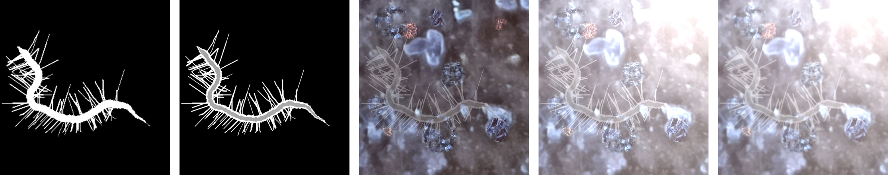
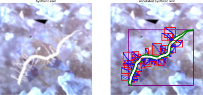

# Synthetic Root Hair Image Generation

This repository provides the code for generating synthetic, high-quality, and fully annotated images of root and root-hair structures. These images can be used for training instance segmentation models, minimizing or even eliminating the need for real-world image acquisition and annotation.

**As described in the upcoming publication: A Novel Approach for Plant Root-Hair Counting
 and Its Improvement via Image Super-Resolution ** [Link to the paper will be updated soon]

Examples of synthetic image generation pipline:


Example of synthetically generated image, next to its full segmentation annotation




## Overview

The process leverages a combination of techniques to create realistic and diverse synthetic images. This involves:

* **Procedural Generation:** Algorithms are used to generate the intricate structures of roots and root hairs.
* **Realistic Rendering:** Techniques are employed to simulate realistic lighting, textures, and backgrounds, making the synthetic images appear similar to real-world microscopy images.
* **Automatic Annotation:** The generation process inherently provides precise annotations for each root and root-hair instance, eliminating the need for manual labeling.

This approach allows for the creation of large, unique datasets with perfect annotations, which can significantly benefit the training of robust segmentation models for root analysis.

## Requirements

* Python 3.8 or higher
* The required Python libraries are listed in `requirements.txt`.

## Installation

1.  Clone this repository:
    ```bash
    git clone <repository_url>
    cd <repository_name>
    ```
2.  Install the necessary dependencies:
    ```bash
    pip install -r requirements.txt
    ```

## Usage

The starting point of this repo is the 'create_dataset.py' file. you should run it to start generating images
with defaults configurations. 

## Acknowledgments

This work is supported by the Israeli Ministry of Agriculture and Rural Development: Development of an automatic system for characterizing the root system for optimal irrigation and fertilization.